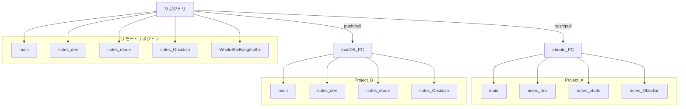

# Repository Configuration Diagram

### 構想イメージ

> 凡図

```mermaid

flowchart TD

    A[リポジトリ] -->|push/pull| B[ubuntu_PC]
    A -->|push/pull| C[macOS_PC]
    
    subgraph リモートリポジトリ
        direction TB
        D[main]
        E[notes_dev]
        F[notes_etude]
        G[notes_Obsidian]
        H[WholeSheBang/hotfix]
    end

    subgraph Project_A
        direction TB
        I[main]
        J[notes_dev]
        K[notes_etude]
        L[notes_Obsidian]
    end

    subgraph Project_B
        direction TB
        M[main]
        N[notes_dev]
        O[notes_etude]
        P[notes_Obsidian]
    end

    A --> D
    A --> E
    A --> F
    A --> G
    A --> H
    B --> I
    B --> J
    B --> K
    B --> L
    C --> M
    C --> N
    C --> O
    C --> P

```

---
